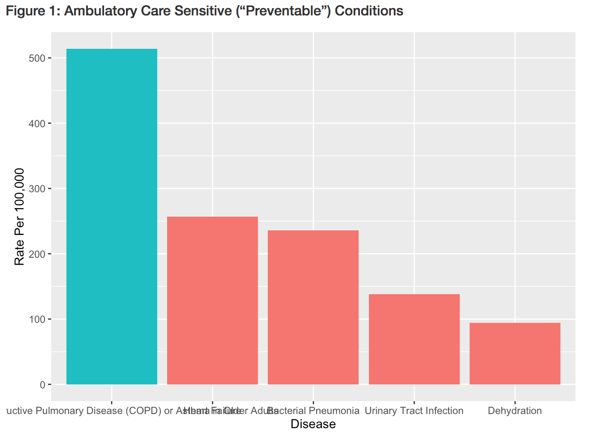

MATH 216 Data Science Final Project (Fall 2016)
================

-   Name: Andrea Narciso
-   Project title: Risk Factors of Asthma
-   Write-up on RPubs: <http://rpubs.com/anarciso/final_project>
-   Abstract: 

The graph below shows the rate of hospitalization per 100,000 of all Ambulatory Care sensitive conditions (ACSC) in New York State in 2014. The ACSCs are deemed as "preventable" because they are diseases and conditions that could have been prevented or whose detrimental effects could have been minimized through treatment outside of the hospital, through out-patient clinics or the improvement of living or environmental conditions. This shows that among the list of preventable conditions, Asthma or Chronic Obstructive Pulmonary Disease has the highest rate of hospital admissions in New York State in 2014. In this analysis, I investigated the correlational relationship between the rates of asthma, as measured by the rate of hospital admissions due to asthma per 100,000, of children under 18 and adults 18 and over and three chosen factors: air quality, income per capita and proportion of the population without health insurance in New York State in 2014. The results showed a negative, negative and positive correlation, respectively, and showed the Bronx as a consistent extreme in all of the measures.

